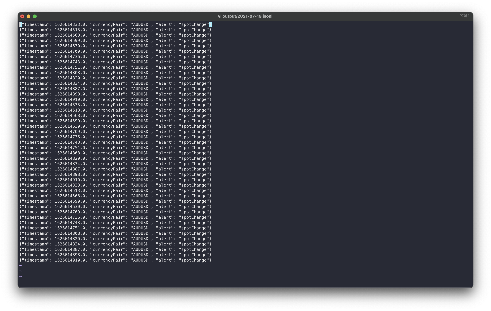
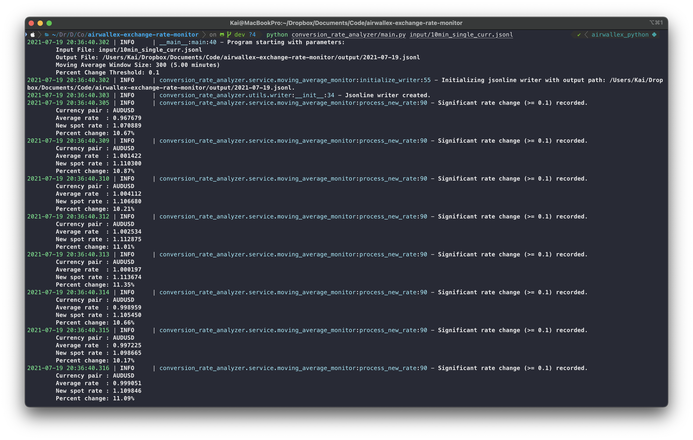
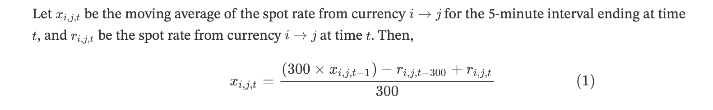
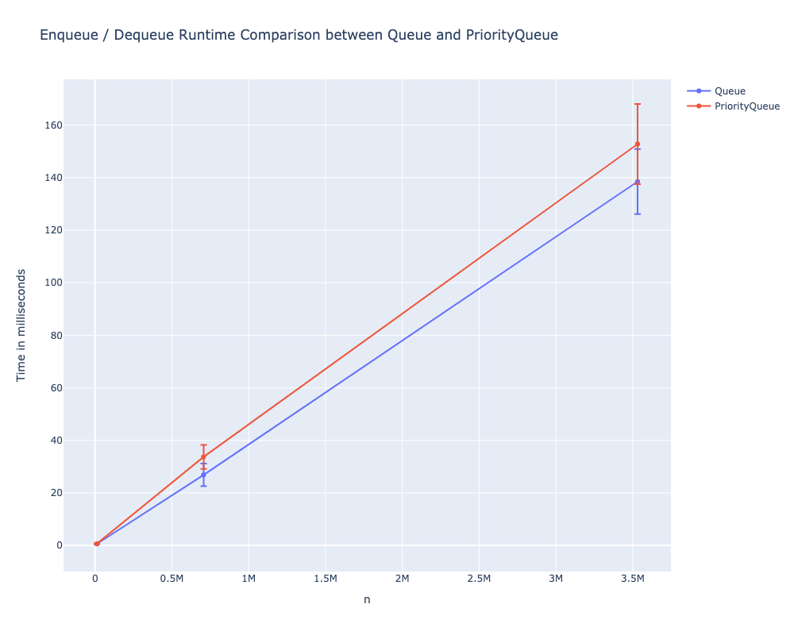

# Summary
Coding challenge for Airwallex. For details on the challenge, see [Challenge.md](Challenge.md).

Time given: July 16 Friday 6PM - July 19 9AM

This program:
- Reads from input jsonline file passed via command line argument,
- convert each line into a `CurrencyConversionRate` object after validating data,
- uses the `MovingAverageMonitor` singleton object to monitor the conversion rates for each currency pair, and
  continuously updating the moving averages based on the latest `n` records as specified in `config.py`. 
- When the percentage difference between a new conversion rate, and the current moving average exceed
  the acceptance threshold, the program will print to the console and log that alert to the output file, which is saved in the `output` directory.
- All logs are captured and stored in `logs` directory as well.
- Every line of code in `conversion_rate_analyzer`, with some exceptions, are covered by tests.

# Run
After installing the dependencies by running `pip install -r requirements.txt`,
from the project root directory, run

```
python conversion_rate_analyzer/main.py <input.jsonl>
```

Example:
```
python conversion_rate_analyzer/main.py example/input1.jsonl
```

## Test

### Without Docker
From the project root directory, run

```
make test
make clean
```
This will run the tests, generate code coverage report, and then remove the artifacts created by the tests.

### With Docker
From the project root directory, run

```
docker-compose up --build
docker-compose down
```
The `Dockerfile` and `docker-compose.yml` are already configured to start the container and automatically run all the tests.

# About

Outputs
- The program makes use of extensive logging. As such, while the prompt asked for the jsonlines to be printed to the standard output, I designed the logging to print the alerts in a more human-friendly format.	
- The specified jsonline output for spot rate change is saved to output file in `output` directory.
- Logs are saved in the `logs` directory.

Output Jsonlines



Logging



## Design

Based on the assumption that new data point for each conversion rates are received every second, the number of data points received per second is

	P(n,2) = n! / (n-2)!

Where `n` is the number of currencies that Airwallex supports. 

If `n = 100`, then `P(100, 2) = 9900` data points will need to be processed every second.

## Updating Moving Averages
To avoid having to compute the sum of all the elements in the queue every time, `MovingAverageMonitor` keeps track of the sum and count of all the items in the queue. When the queue is full and new data arrives, the dequeued conversion rate is subtracted from the sum, and then the new conversion rate is added. By doing this, maintaining the updated moving average conversion rate is a constant time operation.

Formally,



[comment]: <> (Let $x_{i,j,t}$ be the moving average of the spot rate from currency $i \rightarrow j$ for the 5-minute interval ending at time $t$, and $r_{i,j,t}$ be the spot rate from currency $i \rightarrow j$ at time $t$. Then,)

[comment]: <> ($$)

[comment]: <> (x_{i,j,t} = \frac{&#40;300 \times x_{i,j,t-1}&#41; - r_{i,j,t-300} + r_{i,j,t}}{300})

[comment]: <> ($$)

## Data structure considerations

For keeping track of moving averages, `Queue` and `PriorityQueue`, which are included in the `queue` standard library were considered.

> Tradeoff: Speed vs Correctness of Moving Average

- Queue
	- Enqueue / Dequeue: O(1)
	- If currency exchange rate data arrives out-of-order, items in the queue will be dequeued in the order that they came in.
	- Moving averages can be inaccurate when items are dequeued in the order in which they were inserted in.
		- If the `maxsize` is big enough, the error that arises as a result of out-of-order data points will be minimized.
- PriorityQueue
	- Enqueue / Dequeue: O(log n)
	- Even if currency exchange rate data arrives out-of-order, items will still be dequeued according to priority (timestamp), thereby retaining the accuracy of moving averages.
		- As long as data points are not lost in transit (or even if they get lost, they simply need to be retransmitted out-of-order), the moving average will be correct.

### Performance Comparison

To compare the performance between the two, three versions of dummy data was generated.

For generating dummy data, 109 currencies were used to generate 11772 possible currency pairs.

Then, using all currency pairs, dummy conversion rate data was generated for durations of 1 second, 1 minute, and 5 minutes.

The primary objective of this benchmarking is to ensure that at this scale, all 11772 data points can be processed faster than the interval in which they arrive at, with enough "room" to allow further processing of each conversion data (especially since this program is written in Python).

For each size of dummy data, enqueue and dequeue operations were executed for every data point. Furthermore, each dummy data was processed 10 times to rule out outliers. 


Summary data listed below.

| Context     | Data points |   Queue Mean |   Queue Std |   PriorityQueue Mean |   PriorityQueue Std |
|------------:|------------:|-------------:|------------:|---------------------:|--------------------:|
| 1 second    |    11772    |     0.578296 |     0.03333 |             0.630821 |             0.11334 |
| 1 minute    |   706320    |    26.8362   |     4.31205 |            33.7034   |             4.54141 |
| 5 minutes   |  3531600    |   138.484    |    12.4045  |           152.787    |            15.2419  |



Interactive plot in [misc/comparison.html](misc/comparison.html).

From the graph, we can see that the growth in runtime with respect to growth in input size is approximately linear, even for Priority Queue.
Since the input data is expected to arrive in a fixed interval, small increase in runtime that comes with using Priority Queue is an acceptable tradeoff for maintaining accurate moving average.
It's worth noting that for Priority Queue, the standard deviation of runtime also grows at a rate slightly larger than that of Queue's as the input size grows.

## Note

Code used to generate dummy data and to perform the benchmarking tests can be found in the `misc` directory. The dependencies for that are not included in `requirements.txt`.
I've included the html export of the Jupyter notebook in case you want to see. 

## Extension / Further development

Things that I considered adding, but were either not important or necessary for the given task, or needed more time to implement.

- Rewrite using Scala. I don't really have a justification, I just want to because I'm learning Scala at the moment.
	- By nature of functional programming, I could create a service that accepts functions as parameter, and these functions can be run on the moving averages. This would make extending and adding more analysis easier. I can't do this with Python because while I can pass functions as objects, there will be absolutely no type safety and the program cannot be designed to know which type of data the passed function accepts.
	- I don't have a strong argument for why Scala over Java. I can code in Java, but at this point my proficiency in Scala and Java are about the same.
- Create a trend analyzer service that runs on a separate thread. Modify `MovingAverageMonitor` to append every moving average conversion rate to a csv file. 
	- Trend analyzer can look at that data to do more sophisticated monitoring (for example, monitor percentage change over a longer period of time, or continuously monitor the % change of % change)
	- If compute-intensive or longer processing needs to be done, move all of those tasks to trend analyzer so that those tasks do not block the `MovingAverageMonitor`.
		- Python may not be the best for this due to Global Interpreter Lock
- Add a real-time dashboard (for example, using Dash by plotly).